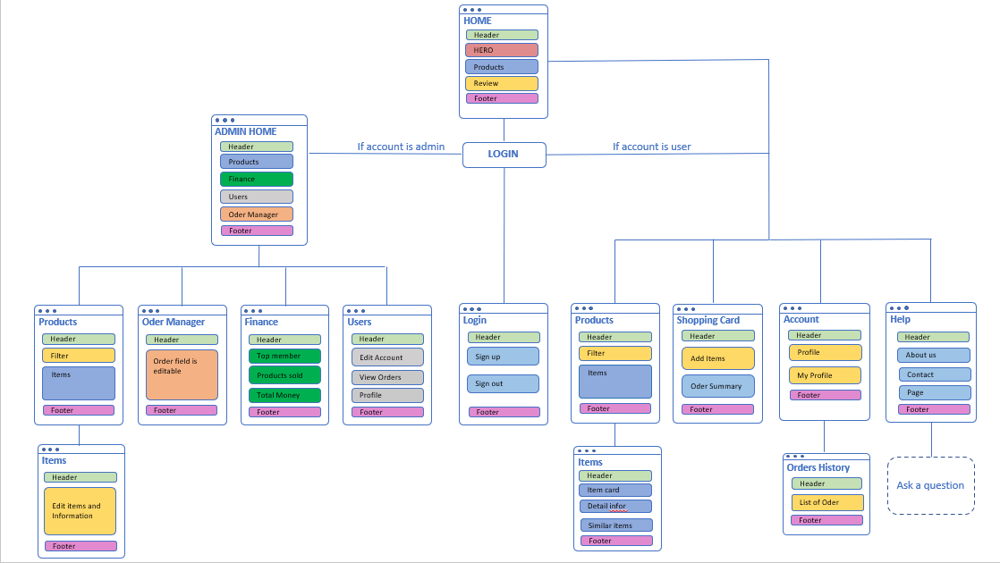

# *VieWS*

### Table of contents
- [*VieWS*](#views)
- [Table of contents](#table-of-contents)
- [Member](#member)
- [About the project](#about-the-project)
- [Wireframe](#wireframe)
- [Technical Requirements](#technical-requirements)
- [Features](#features)
- [Technologies](#technologies)

# Member
To run this project, we have members:

* SE160451 Nguyễn Thanh Toàn
* SE160471 Lê Thanh Tùng
* SE160479 Nguyễn Trung Hiếu

# About the project
- **Name of the System**: *VietNam WatchStore* (VieWS) 
- **Purpose of the System**: The purpose of the VietNam WatchStore is to provide watch retailers with a centralized and efficient solution for managing their store operations. - The system aims to streamline tasks such as inventory management, customer management, sales management and reporting. 
- **Who uses the system**: The system is designed for watch retailers and watch stores who are looking for an organized and efficient way to manage their business. 
# Wireframe
- **Site map**

   

# Technical Requirements

- The website should be built using HTML, CSS, Java and Tomcat.
- The website should be responsive and accessible on all devices, including desktop, tablet, and mobile.
- The website should be powered by a content management system (CMS) that allows for easy updating and management of products and content.
- The website should have a secure and robust back-end system for handling customer data and transactions.
- The website should integrate with a payment gateway for processing transactions.
- The website should be optimized for search engines to improve visibility and drive traffic.
- The website should be hosted on a secure and reliable server.

# Features
**ADMIN**:
1.	**Manage customer account information**: Administrators can view, edit and delete customer account information on the system.
2.	**Order management**: The administrator can view, edit and delete customer order information on the system.
3.	**Product management**: Administrators can add, edit and delete product information on the system.
4.	**Report management**: Administrators can view reports on revenue, orders, and products sold on the system.

**USER**:
1.	**Search and view watch products**: Customers can search for watch products by name, type, price and brand, and view the details of each product.
2.	**Order**: Customers can order watches through the website, choose a payment method and a shipping address.
3.	**View order history**: Customers can view the history of orders placed and the status of those orders.
4.	**Product reviews**: Customers can rate watch products and write reviews about them.
5.	**Account management**: Customers can update personal information and change account password.

	
# Technologies
Project is created with:
* Netbean: 8.2
* Java: 1.8
* Tomcat: 8
* SQL: SMSM19

